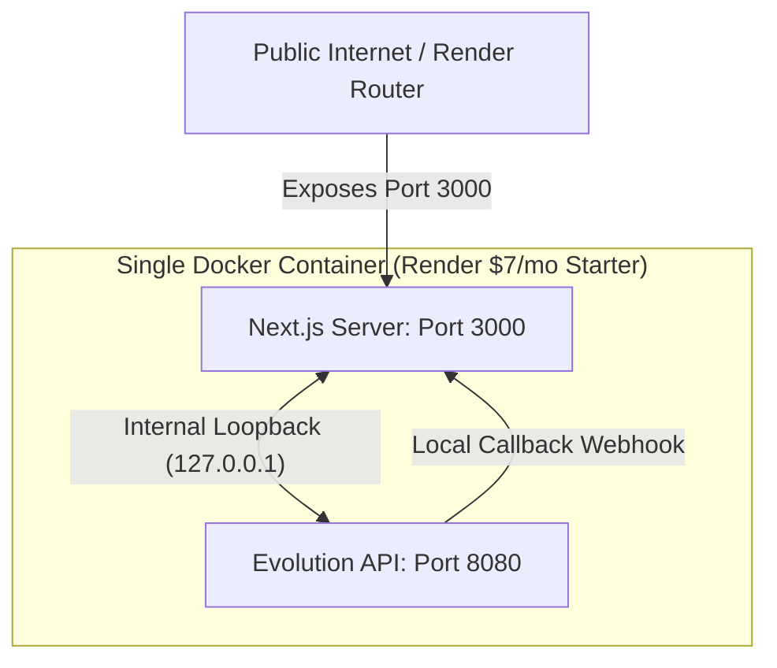

# 🏪 WhatsCommerce

### Automated WhatsApp Storefront & Payment Split-Gateway for African SMEs

WhatsCommerce is a headless, multi-tenant conversational commerce engine designed to digitize manual selling on WhatsApp for local African SMEs (restaurants, retail storefronts, boutique sellers, cosmetics shops, delivery operations). 

By integrating a **session-based WhatsApp Gateway (Evolution API)** and **PayHero Kenya**, WhatsCommerce enables merchants to instantly take orders, trigger native Safaricom M-Pesa STK push checkouts, split platform commission cuts automatically, generate professional A4 ledger sheets, and receive funds **instantly (T+0)**.

---

## 🚀 Key Value Propositions & Features

*   **Multi-Tenancy via Session-Based Gateways:** Bypasses Meta's official API costs and registration bureaucracy. Every merchant links their existing WhatsApp Business number via a simple QR code. Customers chat directly with the merchant's number.
*   **Upfront Split Payments (PayHero Kenya):** Solves the local working capital delay. 
    *   *Model A (Flat monthly):* Settles KES 3,500/month upfront. All customer payments hit the merchant’s Till instantly.
    *   *Model B (5% split commission):* Customer payments hit your platform's master Till. Next.js instantly calculates your 5% platform cut and executes an automated B2C payout of the 95% share to the merchant's M-Pesa in **3 seconds**. You get paid upfront at the millisecond of the transaction.
*   **A4 Financial Ledger & Automated Database Pruning:** Keeps your live database size static and stays within free database hosting tiers forever. All active transaction details are compiled weekly into an elegant **A4 business ledger PDF** delivered directly to the merchant's WhatsApp, after which live order rows are hard-deleted from Supabase.
*   **Direct STK Push Experience:** No customer payment link clicks are required. The M-Pesa PIN prompt pops up directly on their phone screen.
*   **Visual Cart Verification:** Sends customer order summaries followed by high-quality product images from storage to visually verify their cart items prior to checkouts.

---

## 🐳 Single-Service Multi-Process Docker Architecture

WhatsCommerce is packaged as a **single, multi-process Docker bundle** controlled via **Supervisord**. It runs both the **Next.js server** and the **Evolution API gateway** concurrently inside the same container.



### Major Security & Cost Benefits:
1.  **Low Hosting Cost:** Run both Next.js and the WhatsApp gateway inside a single Render paid Web Service (**$7/month total**), completely bypassing VPS operational overheads.
2.  **Internal Loopback Security:** Evolution API webhooks POST callbacks directly to `http://127.0.0.1:3000/api/webhook` internally. This loopback network never touches the public internet, making it **100% immune to external packet sniffing or spoofing**.
3.  **Gateway Obfuscation:** The Evolution API port `8080` is not exposed to the public internet. Only Next.js is mapped publicly. Onboarding portals retrieve QR codes via `/api/onboard` internally, making the gateway invisible to external hackers.

---

## 🛠️ Technology Stack & Dependencies

*   **Backend Framework:** Next.js (Node.js/TypeScript)
*   **Database & Storage:** Supabase (PostgreSQL & Supabase Storage)
*   **WhatsApp Gateway:** Evolution API (TypeScript Baileys Wrapper)
*   **Payment Aggregator:** PayHero Kenya (Lipa na M-Pesa C2B & B2C APIs)
*   **Ledger Generation:** jsPDF (Client & Server-side PDF generators)
*   **Process Supervisor:** Supervisord (Embedded inside Alpine-Node)

---

## 📦 Getting Started & Deployment

### 1. Database Migration Setup
Initialize your Supabase database schema by running the SQL scripts inside your Supabase SQL Editor:
1.  Run [`migrate-v2.sql`](file:///C:/Users/USER/Desktop/Kegacy%20Projects/opportunities/migrate-v2.sql) (Core database structures).
2.  Run [`migrate-v4.sql`](file:///C:/Users/USER/Desktop/Kegacy%20Projects/opportunities/migrate-v4.sql) (Split-routing and subscription columns).

### 2. Configure Environment Parameters
Create a `.env.local` file in your root directory based on the variables template inside [`.env.example`](file:///C:/Users/USER/Desktop/Kegacy%20Projects/opportunities/.env.example):

```env
# Supabase
NEXT_PUBLIC_SUPABASE_URL=https://your-supabase-id.supabase.co
SUPABASE_SERVICE_ROLE_KEY=your_supabase_service_role_key

# Evolution API Internal Loopback Settings
EVOLUTION_API_URL=http://127.0.0.1:8080
EVOLUTION_API_KEY=apikey_whatscommerce_dev_2026
EVOLUTION_WEBHOOK_TOKEN=whatscommerce_webhook_secure_token_2026

# PayHero Kenya Credentials
PAYHERO_API_USERNAME=your_payhero_api_username
PAYHERO_API_PASSWORD=your_payhero_api_password
PAYHERO_PLATFORM_CHANNEL_ID=your_platform_master_paybill_or_till

# General Configuration & Cron Secrets
BASE_URL=https://your-app-name.onrender.com
CRON_SECRET=cron_pruning_secret_2026_abc123
```

### 3. Deploy to Render ($7 Starter Tier)
1.  Connect your GitHub repository to your Render Dashboard.
2.  Select **Web Service** and choose **Docker** as the environment.
3.  Add the environment variables in the Render Settings panel.
4.  Render will automatically build the multi-stage image and run Supervisord.

### 4. Host the Onboarding Dashboard Portal
*   Upload [`public/onboard.html`](file:///C:/Users/USER/Desktop/Kegacy%20Projects/opportunities/public/onboard.html) directly to your **Hostinger file manager** (rename it to `index.html` if you want it to serve as the landing page).
*   Merchants complete the form, check the signed SaaS contract, click submit, and scan the live WhatsApp QR code rendered dynamically from the terminal container!

---

## 📖 Merchant Admin Commands (WhatsApp Bot Interface)

Once a merchant is manually approved and live, they can manage their menu directly from their personal phone:
*   📸 Photo + `/add [Name], [Price], [Category]` — Adds a product with its corresponding photo.
*   📝 `/add [Name], [Price], [Category]` — Adds a text-only product.
*   📋 `/list` — Lists all available menu items in their store.
*   📊 `/report daily` — Generates and messages an A4 daily business report.
*   📈 `/report weekly` — Generates and messages an A4 weekly business report draft.
*   🗑️ `/delete [Name]` — Removes a product from their storefront.
*   📦 `/orders` — Lists today's successful, paid transactions.
*   ℹ️ `/help` — Displays all merchant admin commands.
